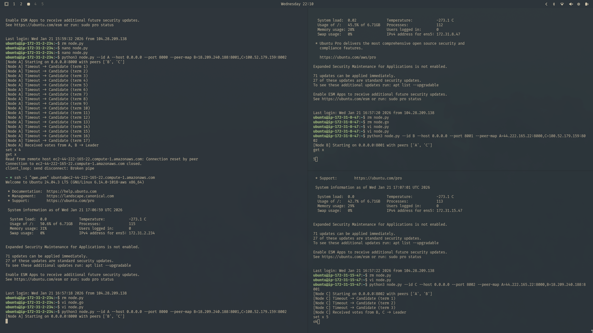

# Lab 3 — Consensus (Raft Lite) Deployment — Report

## 1) Objectives and learning outcomes

The work implements a simplified Raft algorithm (Raft Lite), enabling:

- explanation and implementation of consensus,
- leader election and log replication,
- leader failure handling and cluster recovery,
- observation of safety and liveness properties,
- deployment and testing on EC2.

## 2) What was built

A three‑node Raft Lite cluster was deployed. The requirements met are:

- at most one leader exists at any time,
- client commands are accepted by the leader,
- commands are replicated to followers,
- commit happens after majority acknowledgments,
- a new leader is elected after leader failure.

Full Raft features (snapshots, log compaction, dynamic membership) were not required and are not implemented.

## 3) Scope and requirement compliance

**Required (implemented):**
- leader election,
- heartbeats,
- log replication,
- majority‑based commit,
- leader crash recovery.

**Not required (not implemented):**
- log compaction,
- persistent storage,
- membership changes,
- Byzantine fault tolerance.

## 4) System model

- nodes: 3 EC2 instances (A, B, C),
- roles: Follower, Candidate, Leader,
- communication: HTTP,
- failure model: crash‑stop,
- network: asynchronous with timeouts.

## 5) Node state (requirement compliance)

Each node maintains:

- `currentTerm`
- `votedFor`
- `log[]` (commands with term)
- `commitIndex`
- `state` ∈ {Follower, Candidate, Leader}

## 6) Message types (Raft Lite)

Implemented messages:

- `RequestVote(term, candidateId)`
- `VoteResponse(term, voteGranted)`
- `AppendEntries(term, leaderId, entries[])`
- `AppendResponse(term, success)`

## 7) Part 1 — leader election (results)

Behavior matches requirements: nodes start as Followers, transition to Candidate on timeout, increment term and request votes; the leader is elected by majority and sends heartbeats.

Logs (expected format):

```
[Node B] Timeout -> Candidate (term 3)
[Node B] Received votes from A, C -> Leader
```

## 8) Part 2 — log replication (results)

Client commands are accepted by the leader, appended to the leader log, replicated, and committed after majority confirmation. Followers apply entries by `commitIndex`.

Logs (expected format):

```
[Node A] Append log entry (term=3, cmd=SET x=5)
[Node C] Append success
[Node A] Entry committed (index=2)
```

## 9) Part 3 — failure experiment (required demonstration)

### Scenario A — leader crash

The leader was stopped; a new leader was elected after the timeout. New commands were accepted and committed by the majority of remaining nodes.

### Scenario B — follower crash

One follower was stopped while the leader continued accepting commands. After restart, the follower caught up via replication.

## 10) Cluster deployment (brief)

The cluster ran on three nodes:

- A: 44.222.165.22 (port 8000)
- B: 18.209.240.188 (port 8001)
- C: 100.52.179.159 (port 8002)

Startup commands (recorded for the report):

```bash
python3 node.py --id A --host 0.0.0.0 --port 8000 --peer-map B=18.209.240.188:8001,C=100.52.179.159:8002
python3 node.py --id B --host 0.0.0.0 --port 8001 --peer-map A=44.222.165.22:8000,C=100.52.179.159:8002
python3 node.py --id C --host 0.0.0.0 --port 8002 --peer-map A=44.222.165.22:8000,B=18.209.240.188:8001
```

## 11) Safety and liveness checks

- **At most one leader per term**: ensured by majority voting.
- **No committed entry is lost**: commit only after majority ACKs.
- **All nodes eventually agree**: ensured by heartbeats and replication.

## 12) Demonstration screenshot



## 13) API (for the report)

### `POST /request_vote`
```json
{"term": 3, "candidateId": "B"}
```

### `POST /append_entries`
```json
{"term": 3, "leaderId": "A", "startIndex": 0, "entries": [{"term": 3, "command": "SET x=5"}], "leaderCommit": 0}
```

### `POST /client_command`
```json
{"command": "SET x=5"}
```

### `GET /status`
Response contains: `nodeId`, `state`, `term`, `leaderId`, `commitIndex`, `log`.
