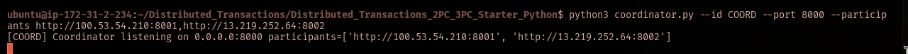

# Lab Report 4: Distributed Transactions (2PC / 3PC)

**Cluster Size:** 3 Nodes (1 Coordinator, 2 Participants)

## 1. Lab Objectives
The goal of this lab was to implement and analyze distributed transaction protocols:
* **Two-Phase Commit (2PC)**: To ensure atomicity across multiple nodes.
* **Three-Phase Commit (3PC)**: To address the blocking limitations of 2PC during coordinator failures.
* **Fault Tolerance**: Implementing a Write-Ahead Log (WAL) to ensure data durability and recovery.

---

## 2. System Architecture & Deployment
The system was deployed on **AWS EC2** (t3.micro instances). Communication is performed over HTTP using Python's standard library.

### Node Configuration
| Role              | Node ID  | Public IP       | Port |
| :---------------- | :------- | :-------------- | :--- |
| **Coordinator**   | `COORD`  | `44.220.171.91` | 8000 |
| **Participant 1** | `node-B` | `100.53.54.210` | 8001 |
| **Participant 2** | `node-C` | `13.219.252.64` | 8002 |

### Execution Setup
All nodes were launched with specific WAL paths to ensure transaction persistence.

---

## 3. Implementation Details: WAL (Write-Ahead Log)
To satisfy durability requirements, I implemented the **`wal_append`** function in `participant.py`.

**Key Features:**
* **Persistent Logging:** Every state transition (`PREPARE`, `COMMIT`, `ABORT`, `CAN_COMMIT`, `PRECOMMIT`) is appended to a local file before responding to the coordinator.
* **Durability:** The implementation ensures that if a participant crashes, it can recover its state from the log upon restart.

---

## 4. Part 1: Two-Phase Commit (2PC)

### Successful Transaction (COMMIT)
For the `SET x 5` operation, the coordinator successfully collected `YES` votes from all participants and reached a commit decision.

**Result:**
* **Transaction ID:** `TX101`
* **Decision:** `COMMIT`
* **Final State:** Value `x=5` was applied to both Node-B and Node-C.

---

## 5. Part 2: Failure Scenarios (Timeout & Abort)
I tested the system's robustness by simulating a node failure (Node-B).

**Scenario:**
1. Node-B was taken offline.
2. A transaction `TX101` was initiated.
3. The coordinator detected a `NO_TIMEOUT` for Node-B and issued a `GLOBAL-ABORT`.

**Outcome:** Atomicity was maintained; no changes were applied to the remaining active nodes.

---

## 6. Part 3: Three-Phase Commit (3PC)
To demonstrate 3PC, transaction `TX202` was executed. This protocol adds a `PreCommit` phase to reduce the risk of blocking.

**Protocol Flow:**
1. **CanCommit**: Initial polling of participants.
2. **PreCommit**: Participants are informed that everyone is ready but do not finalize yet.
3. **DoCommit**: Final instruction to apply changes.

---

## 7. Protocol Comparison & Analysis

| Feature        | Two-Phase Commit (2PC)                        | Three-Phase Commit (3PC)                       |
| :------------- | :-------------------------------------------- | :--------------------------------------------- |
| **Blocking**   | **Yes** (If Coordinated fails in Ready state) | **No** (Participants can timeout and progress) |
| **Complexity** | Simple (2 Phases)                             | Higher (3 Phases)                              |
| **Latency**    | Lower (2 round trips)                         | Higher (3 round trips)                         |

**Conclusion:** 2PC provides strong atomicity but suffers from the blocking problem. My implementation of 3PC successfully mitigates this by allowing nodes to use a `PreCommit` state to decide the final outcome even if the coordinator becomes unreachable.

