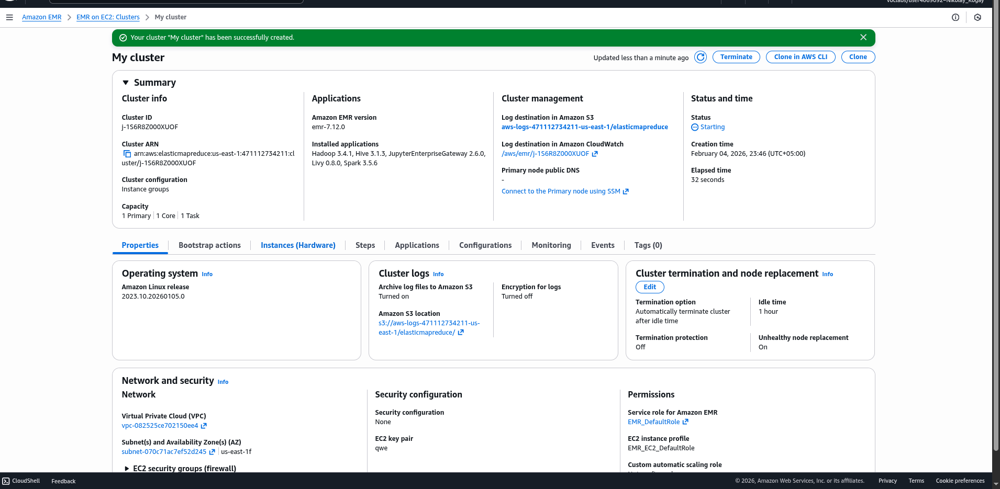

# LAB 5 — Mini-MapReduce on Amazon EMR

## 1. Цели
- Понять модель MapReduce.
- Запустить задачу на Amazon EMR.
- Использовать HDFS для входных/выходных данных.
- Сравнить масштабирование (Case A).
# LAB 5 — Mini-MapReduce on Amazon EMR

## Report: what I did and what I got
Goal: run WordCount on Amazon EMR (Hadoop Streaming) with HDFS, then perform Case A (scaling).

## 1. Stack
- Amazon EMR
- Hadoop MapReduce (Streaming)
- HDFS
- Python

## 2. Dataset
Used Wikipedia text dump (Simple English):
https://github.com/LGDoor/Dump-of-Simple-English-Wiki

Commands on the master node:
```
wget https://github.com/LGDoor/Dump-of-Simple-English-Wiki/raw/refs/heads/master/corpus.tgz
ls -lh corpus.tgz
tar -xvzf corpus.tgz
hdfs dfs -mkdir -p /user/hadoop/input
hdfs dfs -put corpus.txt /user/hadoop/input/
hdfs dfs -ls /user/hadoop/input/
```

## 3. EMR Cluster
Created a cluster with Primary m4.large and Core nodes (2 and 4 nodes for the experiment). Roles: EMR_DefaultRole, EMR_EC2_DefaultRole.

Screenshot: cluster creation


## 4. Connect and verify
SSH:
```
ssh -i key.pem hadoop@<master-public-dns>
```

Cluster checks:
```
yarn node -list
hdfs dfsadmin -report
```

Screenshot: cluster check and nodes


Screenshot: successful SSH login


## 5. Run MapReduce (WordCount)
Hadoop Streaming command:
```
hadoop jar /usr/lib/hadoop-mapreduce/hadoop-streaming.jar \
	-input /user/hadoop/input/ \
	-output /user/hadoop/output/ \
	-mapper mapper.py \
	-reducer reducer.py \
	-files mapper.py,reducer.py
```

Screenshot: job submission


Screenshot: job running (YARN/Job)


## 6. Validate output
```
hdfs dfs -ls -p /user/hadoop/output/
hdfs dfs -head /user/hadoop/output/*
```

Screenshot: HDFS output listing


Screenshot: sample output


## 7. Experiment Case A — Scaling
Scenario:
- Run with 2 core nodes
- Run with 4 core nodes
- Compare runtime

Screenshot: 2 core nodes run


Screenshot: 4 core nodes run


Screenshot: runtime comparison (result evidence)


## 8. Result
WordCount completed successfully on EMR, output stored in HDFS. The scaling experiment shows a runtime difference between 2 and 4 core nodes.
