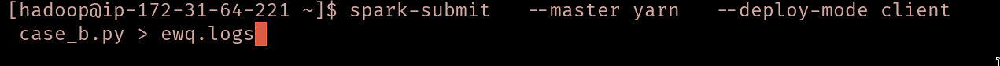

# Lab 6 — Spark ML Pipeline on Amazon EMR (Customer Churn)

## Overview
Built an end-to-end Spark ML pipeline on Amazon EMR to predict customer churn using the Kaggle Bank Customer Churn dataset. The pipeline runs on YARN and uses distributed feature engineering and model training.

## Dataset
**Source:** https://www.kaggle.com/datasets/shrutimechlearn/churn-modelling

**Target:** `Exited` (0 = No churn, 1 = Churn)

## Pipeline (Spark ML)
1. Data loading from HDFS
2. Categorical encoding (StringIndexer + OneHotEncoder)
3. Feature assembly (VectorAssembler)
4. Feature scaling (StandardScaler)
5. Model training (Logistic Regression)
6. Prediction
7. Evaluation (Accuracy)

## Code
Primary script: `churn_pipline.py`

## Run on EMR
```
spark-submit \
	--master yarn \
	--deploy-mode client \
	churn_pipline.py
```

## Experiment (Option B — Feature Ablation)
Removed categorical features and compared accuracy/runtime. See screenshots for evidence and results.

## Screenshots (Evidence)
1. **EMR cluster created and running** — Cluster state in AWS EMR console.
	
2. **Dataset staged in HDFS** — `hdfs dfs -ls /user/hadoop/churn_input` showing the CSV.
	
3. **Spark job submission** — `spark-submit` command executed on the EMR master.
	
4. **Pipeline execution logs** — Spark pipeline stages initializing and running.
	
5. **Model predictions sample** — `Exited`, `prediction`, `probability` output preview.
	
6. **Evaluation metric** — Accuracy printed by the evaluator.
	
7. **YARN monitoring** — Application and executor status in YARN UI.
	
8. **Experiment run (feature ablation)** — Script run without categorical features.
	
9. **Experiment result** — Accuracy/runtime reported for the ablated model.
	
10. **Summary evidence** — Consolidated view of key outputs/results.
	
